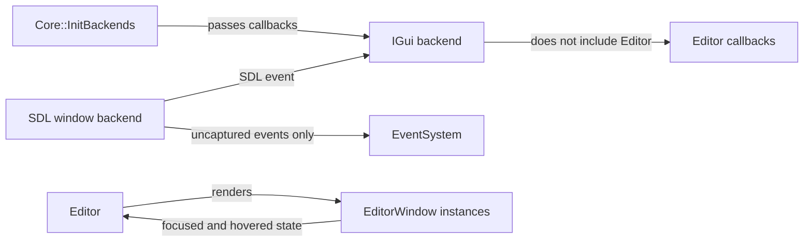
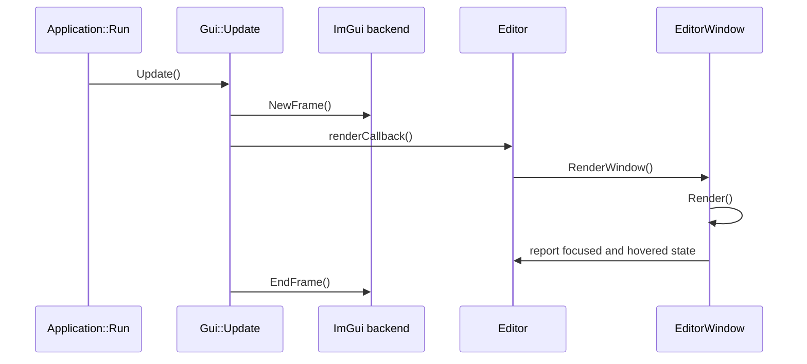
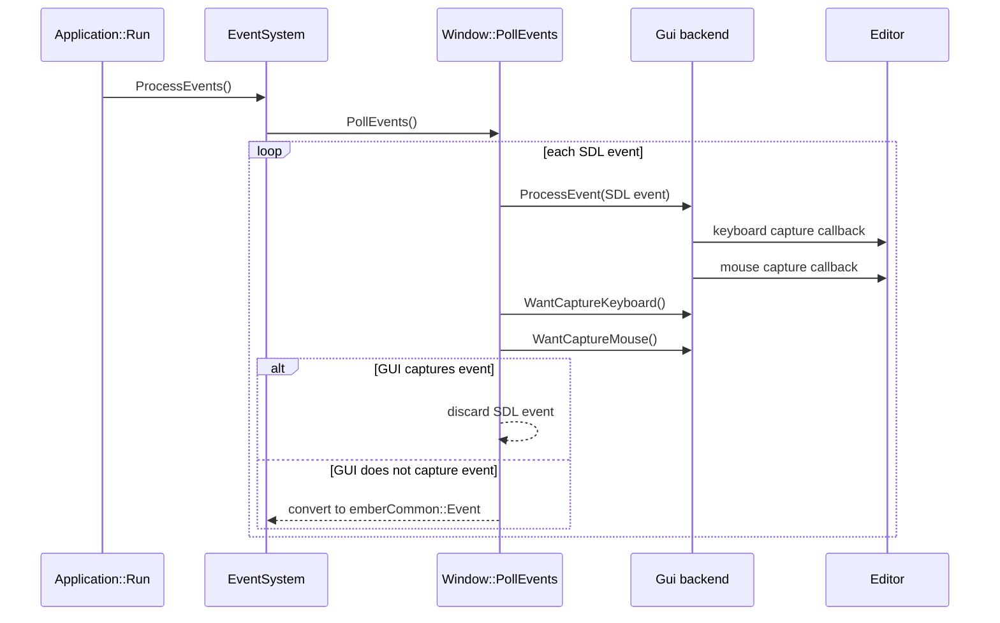
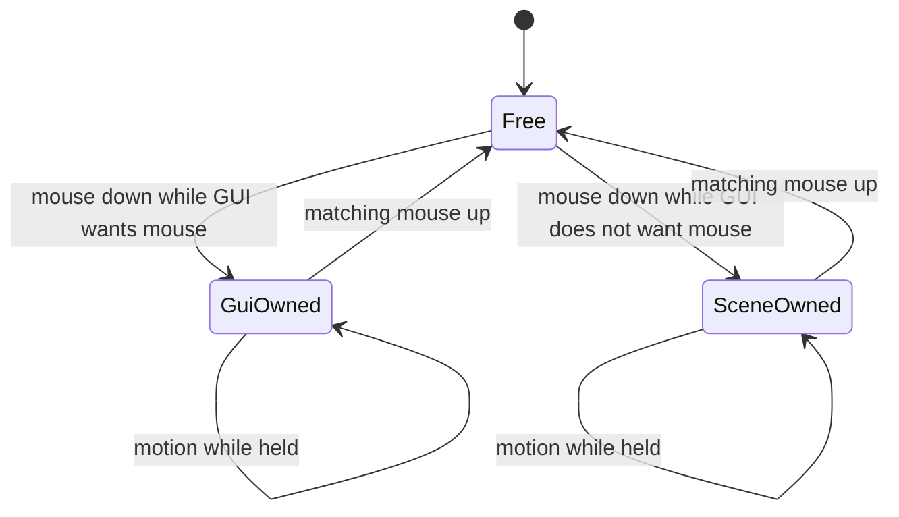

# GUI, Editor, and Input Routing

This page explains how the GUI backend, editor, window backend, and event system cooperate.

The main idea is dependency direction:

- The engine owns editor windows and editor policy.
- The GUI backend owns ImGui frame lifetime and ImGui capture state.
- The SDL window backend owns platform event polling and decides which SDL events become Ember events.
- The event system stores only events that survived platform and GUI filtering.

## System Boundaries



`Core::InitBackends` wires the systems together. It gives the GUI backend three editor callbacks:

```cpp
pIGui->SetEditorCallbacks(
    Editor::Render,
    Editor::GetFocusedWindowWantCaptureEvents,
    Editor::GetHoveredWindowWantCaptureEvents
);
```

The backend can then render editor UI and query editor capture policy without depending on the `Editor` class directly.

## Frame Rendering

Editor windows must render inside an active ImGui frame. Today the GUI backend owns that frame lifetime:



The render callback currently points to `Editor::Render`. That method loops over registered editor windows, sets `s_pCurrentRenderedWindow`, and calls `RenderWindow()` on each window.

## Event Routing

SDL events are filtered before they become Ember events.



The event system does not know which GUI window captured an event. It receives only the events that the SDL window backend decided to convert.

## Capture Policy

ImGui knows whether an active widget wants input. The editor knows whether the current editor window should allow that capture to block scene input.

Those two answers are combined in the GUI backend:

```cpp
m_wantCaptureKeyboard =
    ImGui::WantCaptureKeyboard && Editor::GetFocusedWindowWantCaptureEvents();

m_wantCaptureMouse =
    ImGui::WantCaptureMouse && Editor::GetHoveredWindowWantCaptureEvents();
```

Keyboard uses the focused window because typing belongs to focus. Mouse uses the hovered window because clicking and scrolling belong to the thing under the cursor.

| Input kind | ImGui query | Editor policy query | Reason |
| --- | --- | --- | --- |
| Keyboard | `WantCaptureKeyboard` | focused window wants capture | Text and shortcuts belong to focus |
| Mouse | `WantCaptureMouse` | hovered window wants capture | Clicks and scrolls belong to hover |

## Mouse Button Ownership

Mouse capture is sticky per button. If a mouse button goes down on a GUI-capturing editor window, the SDL window backend keeps that button captured until the matching button-up event.



This prevents a slider drag from becoming a held scene click after the cursor moves over the viewport.

## Editor Window Policy

Each editor window chooses whether it captures events through `m_wantCaptureEvents`.

| Window type | Typical value | Behavior |
| --- | --- | --- |
| Inspector, console, fluid settings | `true` | UI interaction blocks scene input |
| Scene, game viewport | `false` | Input passes through to world/game systems |

This lets scripts keep using `EventSystem` normally. They do not need one-off checks for GUI capture.

## Important Code Paths

| Responsibility | File |
| --- | --- |
| Backend wiring | `engine/core/src/core.cpp` |
| Editor window registration and capture policy | `engine/core/src/editor/editor.cpp` |
| Per-window focused and hovered reporting | `engine/core/src/editor/editorWindow.cpp` |
| GUI interface contract | `engine/interfaces/gui/iGui.h` |
| ImGui frame and capture state | `engine/backends/imGuiSdlVulkan/src/imGuiSdlVulkan.cpp` |
| SDL event filtering and mouse button ownership | `engine/backends/sdlWindow/src/sdlWindow.cpp` |

## Future Cleanup Option

The capture callbacks are useful because the GUI backend should not depend directly on the editor. The render callback is more optional.

A future GUI frame API could make ownership clearer:

```cpp
Gui::BeginFrame();
Editor::Render();
Gui::EndFrame();
```

That would remove the render callback while preserving the capture policy callbacks.