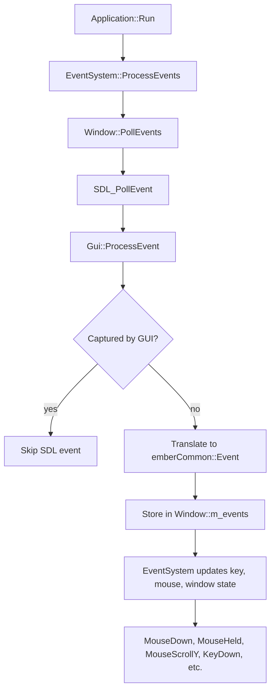
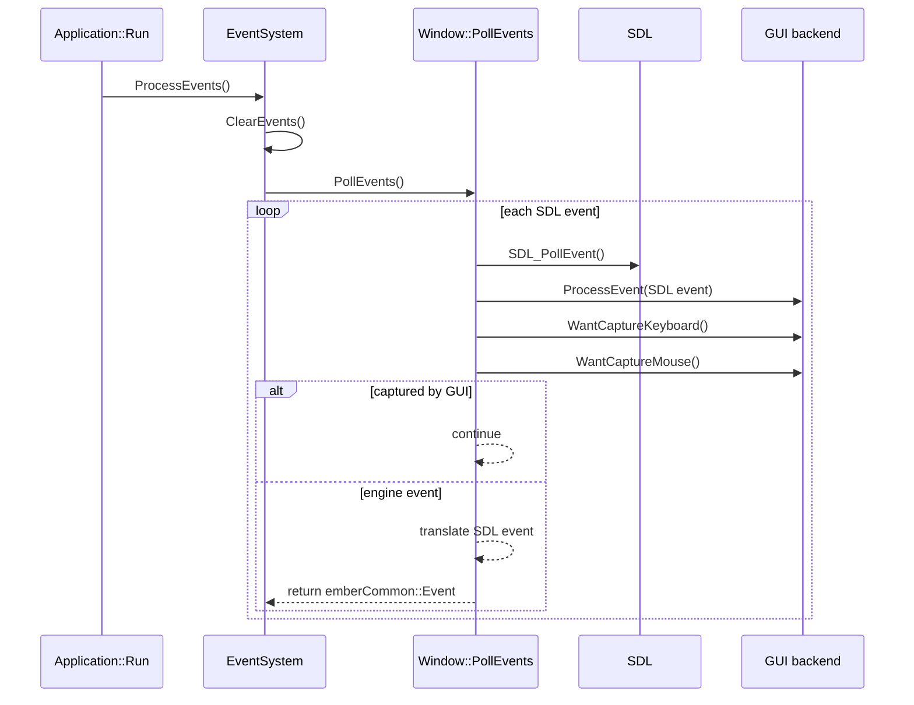
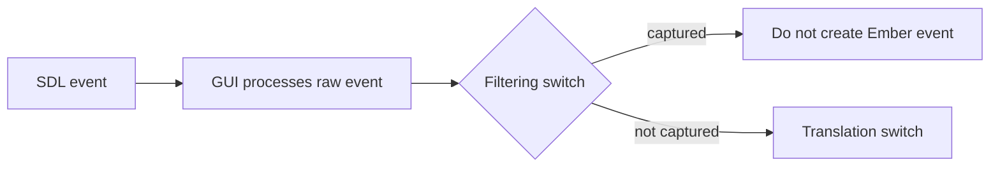
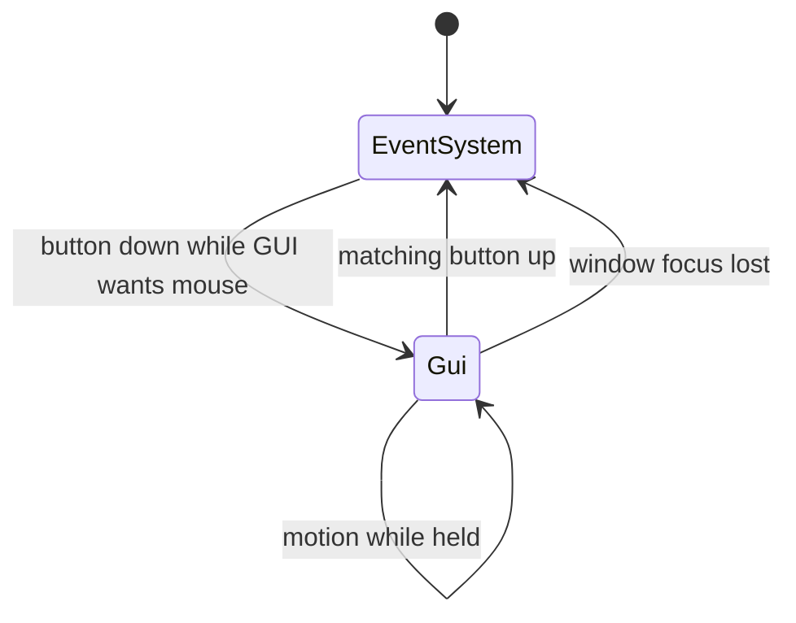
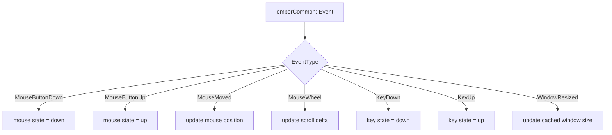

# Window Events

This page explains how Ember receives platform window events and turns them into engine input state.

## Responsibilities

| System | Responsibility |
| --- | --- |
| SDL | Produces raw platform events |
| `sdlWindowBackend::Window` | Polls SDL, lets GUI process raw events, filters captured events, converts surviving events |
| GUI backend | Updates ImGui state from raw SDL events and reports capture state |
| `emberEngine::EventSystem` | Converts `emberCommon::Event` values into queryable input state |
| Gameplay, tools, simulations | Read stable input through `EventSystem` |

## Event Pipeline

Every SDL event is first passed to the GUI backend. This lets ImGui update its internal state before Ember decides whether the event should also become an engine event.

## Polling Loop

The high-level frame path is:

`EventSystem::ClearEvents()` runs before polling. It transitions previous-frame `down` states to `held`, clears previous-frame `up` states, and resets scroll deltas.

## Filtering Switch

`Window::PollEvents()` first decides whether an SDL event should be swallowed by GUI/editor input handling.

Captured events stop at the filtering switch. They do not reach the second switch and never enter the engine event list.

Mouse capture is based on two ideas:

- current GUI capture state for simple click, wheel, and hover interactions
- per-button event target state for drags that started in GUI

Keyboard capture uses the focused editor window policy. Mouse capture uses the hovered editor window policy.

## Mouse Button Targets

Mouse buttons can target either the engine event system or GUI.

The default target is `eventSystem`. If a button-down starts on GUI, that button targets `gui` until the matching button-up. This keeps a GUI drag from becoming a scene drag if the cursor moves over the viewport.

## Translation Switch

Only uncaptured SDL events reach the translation switch.

| SDL event kind | Ember event result |
| --- | --- |
| Quit | `EventType::Quit` |
| Window close | `EventType::WindowClose` |
| Window resize or pixel size change | `EventType::WindowResized` |
| Window minimized | `EventType::WindowMinimized` |
| Window restored | `EventType::WindowRestored` |
| Window focus gained | `EventType::WindowFocusGained` |
| Window focus lost | `EventType::WindowFocusLost` |
| Key down/up | `EventType::KeyDown` / `EventType::KeyUp` |
| Text input | `EventType::TextInput` |
| Mouse motion | `EventType::MouseMoved` |
| Mouse button down/up | `EventType::MouseButtonDown` / `EventType::MouseButtonUp` |
| Mouse wheel | `EventType::MouseWheel` |
| Gamepad events | Controller event types |

Translation also maps backend-specific values into Ember enums, such as SDL mouse buttons into `emberCommon::Input::MouseButton`.

## EventSystem State

After `Window::PollEvents()` returns, `EventSystem::ProcessEvents()` applies each `emberCommon::Event` to engine state.

User code should read input from `EventSystem`, not directly from SDL or the GUI backend.

## Important Code Paths

| Responsibility | File |
| --- | --- |
| Application frame loop | `engine/applications/emberEditorApp/src/application.cpp` |
| Event system polling and state updates | `engine/core/src/eventSystem/eventSystem.cpp` |
| Window backend event polling and filtering | `engine/backends/sdlWindow/src/sdlWindow.cpp` |
| SDL to Ember enum translation | `engine/backends/sdlWindow/src/sdlEventTranslation.h` |
| Shared event representation | `engine/common/commonEvent.h` |
| Shared input enums | `engine/common/commonInput.h` |