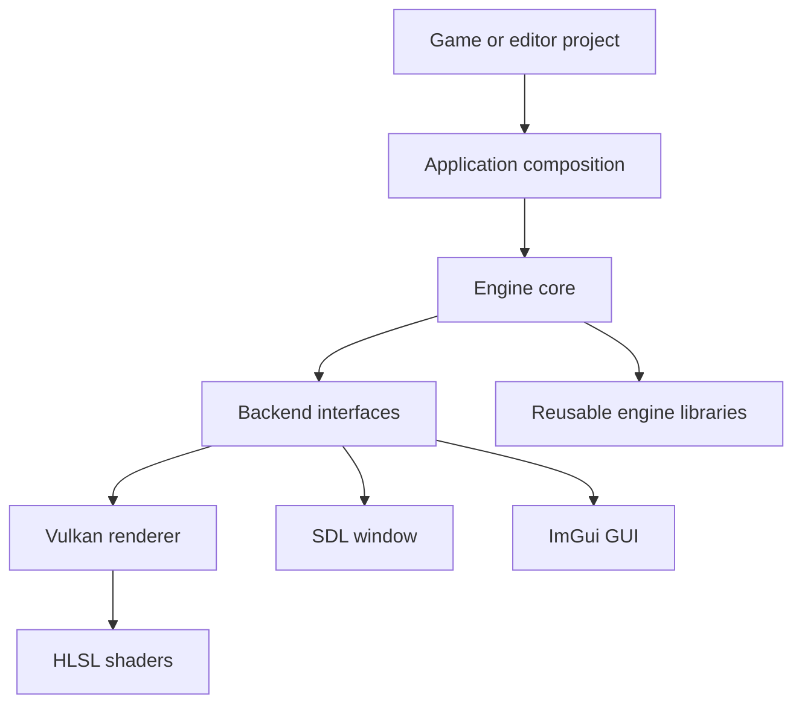

# Ember Engine
Ember is a modular C++ game engine and real-time rendering project based on Vulkan. This documentation will describe the engine's big-picture design, its public APIs, and how its systems work together.

[View the source code](https://github.com/Tom-Olsen/Ember){ .md-button .md-button--primary }

!!! note "Documentation in progress"
    This is the initial documentation page. Architecture guides, API concepts, and system walkthroughs will be added as the documentation develops.

## Architecture at a glance

Ember separates high-level engine behavior from platform and rendering implementations:

- **Applications** assemble the engine for game, editor, debug, or headless use.
- **Core** owns orchestration, resources, rendering facades, events, physics, and editor integration.
- **Interfaces** define backend-independent contracts for rendering, windows, and GUI systems.
- **Backends** implement those contracts with Vulkan, SDL, ImGui, or headless alternatives.
- **Libraries** provide reusable facilities such as asset loading, math, ECS, logging, and task execution.

The [Vulkan Renderer](vulkan-renderer/index.md) section maps the renderer backend's subsystems, their responsibilities, and the flow of a frame through them.

## Planned documentation
- Engine architecture and frame lifecycle
- Detailed render-stage and synchronization design
- GPU resource ownership and synchronization
- Materials, shaders, and compute pipelines
- Event, window, GUI, and editor integration
- Public API usage examples