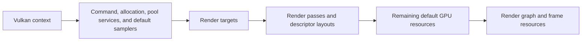

# Context and Lifetime
The Vulkan context owns the foundational objects and state shared by the renderer, compute system, and GPU resources. Higher-level subsystems depend on it but do not recreate device-level services themselves.

## Context responsibilities
The context coordinates:

- Vulkan instance creation and validation support.
- Physical-device selection and supported features.
- The window surface and presentation capabilities.
- The logical device and graphics, present, compute, and transfer queues.
- VMA-backed memory allocation and allocation tracking.
- Swapchain images, image views, extent, and recreation.
- The current frame-in-flight index, absolute frame count, and MSAA configuration.
- Debug names for Vulkan objects.

Descriptor pools, command pools, default GPU resources, render passes, render targets, staging pools, one-time commands, and deferred destruction are separate services built on top of that context.

## Initialization order
The renderer initializes the backend from the bottom up:

Shutdown reverses these dependencies. The device is made idle first, frame and graph objects are released, descriptor layouts and resource pools are cleared, deferred destruction is flushed while its parent pools still exist, and the context is destroyed last.

## Frames in flight
Frame resources are allocated per frame-in-flight slot rather than per swapchain image. A fence prevents a slot from being reset while the GPU is still using it. Swapchain image acquisition and release synchronization remain tied to the images presented by the surface.

This distinction allows CPU preparation and GPU execution to overlap while preserving safe reuse of command pools, descriptor sets, transient draw data, and compute-call resources.

## Swapchain changes
Window resizing marks the swapchain for rebuilding. The renderer waits until resize events settle, then recreates swapchain-dependent state and render-graph synchronization before rendering resumes. Offscreen render resolution and swapchain presentation extent remain separate responsibilities.