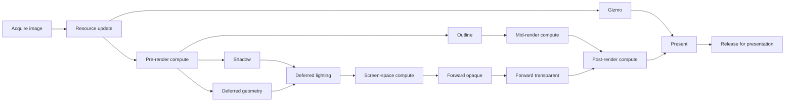

# Frame Lifecycle and Render Graph
The renderer is the coordinator for each frame. The render graph owns the ordered set of stages and the synchronization that connects them. Frame-specific data is passed to those stages through a non-owning frame context.

## Frame preparation
Before recording GPU work, the renderer:

1. Handles a pending window resize and rebuilds swapchain-dependent objects when required.
2. Waits until the current frame-in-flight slot is available and retires its previous compute work.
3. Acquires a swapchain image.
4. Resets the frame's command pools and prepares its scene-color target.
5. Sorts collected draw calls, queues renderer-owned compute work, and updates shader-visible data.
6. Builds a frame context containing execution data, render workloads, frame resources, render targets, GUI integration, and the compute calls recorded for each in-frame queue.

After the graph has recorded and submitted the work, the renderer commits compute usage, resets the collected frame calls, presents the acquired image, and advances the frame index.

## Render graph overview
The graph contains both parallel branches and explicit join points. Each arrow below represents an execution dependency rather than a C++ call hierarchy.

The graph submits stages to the appropriate Vulkan queues and uses semaphores for inter-stage dependencies. A fence tracks completion of each frame-in-flight slot, while the swapchain image is released only after the present stage has finished.

## Frame-scoped data
The backend keeps different kinds of frame state separate:

- **Frame execution data** identifies the frame and swapchain image and carries frame timing.
- **Frame render data** is the CPU-side workload collected for a frame slot, including mesh updates and categorized draw calls.
- **Frame resources** are persistent Vulkan objects for a frame slot, primarily stage command pools, command buffers, and static descriptor sets.
- **Frame context** is a non-owning view that brings execution data, workloads, resources, targets, GUI access, and compute calls together for stage recording.

This separation lets frame slots be reused safely without making individual stages own shared renderer state.