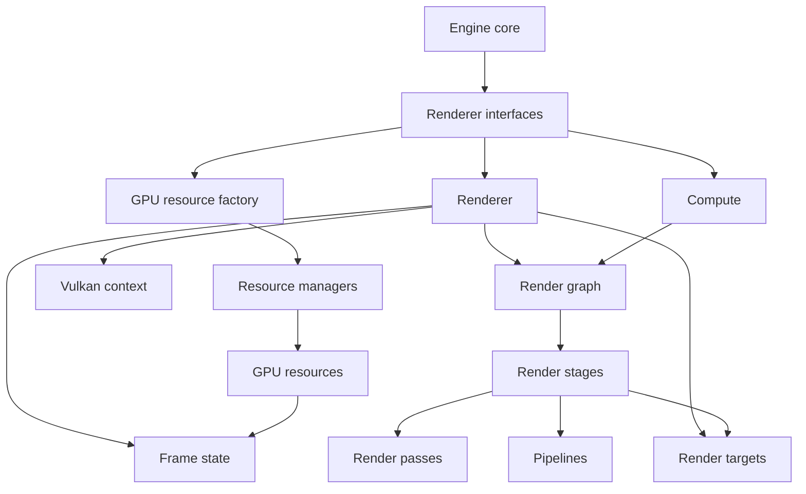

# Vulkan Renderer
The Vulkan renderer is Ember's concrete implementation of the backend-independent renderer interfaces. It translates the engine's draw, compute, and resource requests into Vulkan resources and command submissions while keeping Vulkan-specific concerns outside the engine core.

This section is an architectural map of the backend. It identifies the major subsystems, their responsibilities, and how they cooperate without documenting their implementation in detail.

## Backend boundary
The backend has three main entry points:

- **Renderer** implements the frame loop and drawing interface. It collects lights and draw calls, prepares frame data, and asks the render graph to execute the frame.
- **Compute** provides compute queues integrated into the frame as well as compute work that runs independently from the render graph.
- **GPU resource factory** creates backend resources and exposes the material and compute-shader managers.

The application constructs these backend objects and gives them to the engine core through the renderer interfaces. The renderer also connects to the selected window and GUI backends for surface creation, resizing, and presentation.

## Subsystem map
| Subsystem | Responsibility |
| --- | --- |
| Renderer orchestration | Owns the high-level frame lifecycle, gathers render input, updates shader-visible frame data, and handles swapchain changes. |
| Frame state | Separates persistent resources for each frame-in-flight slot from the CPU-side workload collected for that slot. |
| Render graph | Defines stage dependencies, records each stage, and submits work with explicit queue synchronization. |
| Stages, passes, and pipelines | Turn draw and dispatch workloads into commands, define attachment usage, and provide executable graphics or compute state. |
| Render targets | Own offscreen scene color, depth, G-buffer, shadow, outline, and gizmo images used across the frame. |
| Compute | Schedules compute at defined points in the frame and supports independent asynchronous sessions. |
| Resources and descriptors | Represent buffers, textures, meshes, shaders, and materials and connect them to shaders through descriptor sets. |
| Context and utilities | Own foundational Vulkan objects, allocation services, pools, uploads, deferred destruction, and swapchain state. |

## Documentation map
- [Frame Lifecycle and Render Graph](frame-lifecycle.md) explains how a submitted frame moves through the renderer and how its stages depend on one another.
- [Rendering Pipeline](rendering-pipeline.md) outlines the purpose of the graphics stages and the roles of stages, render passes, pipelines, and draw calls.
- [GPU Resources and Descriptors](gpu-resources.md) describes the resource model, managers, render targets, and descriptor-set hierarchy.
- [Compute](compute.md) separates render-graph compute queues from independent asynchronous compute.
- [Context and Lifetime](context-and-lifetime.md) covers Vulkan initialization, device services, frames in flight, resizing, and cleanup responsibilities.